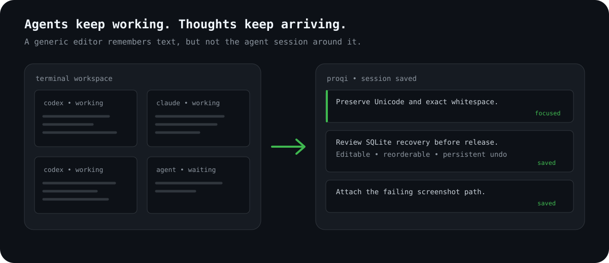

<p align="center">
  
</p>

<h1 align="center">Proqi</h1>

<p align="center">
  <strong>The thoughtpad for humans working with agents.</strong><br>
  Capture prompts, ideas, questions, and follow-ups while your agents are still busy.
</p>

<p align="center">
  <a href="https://github.com/oborchers/proqi/actions/workflows/ci.yml"></a>
  
  
  
</p>

<p align="center">
  
</p>

## The problem

Working with several coding agents creates a second stream of work. While one
agent is busy, the next correction, prompt, file path, or follow-up already
arrives. A generic editor can hold that text, but it does not know which agent
session it belongs to, whether a deletion was intentional, or how to restore
the board after a terminal disappears.

Proqi replaces that side editor with a terminal-native board. Each thought is
independently editable, reorderable, copyable, recoverable, and scoped to one
resumable session. It is deliberately not a FIFO queue. A thought may be used
immediately or remain on the board for days.

<p align="center">
  
</p>

## What Proqi does

| Need | Proqi behavior |
| --- | --- |
| Capture without context switching | Paste in board mode to create and focus a thought immediately |
| Edit like a scratchpad | Multiline Unicode editing, selection, logical-line deletion, and editor undo |
| Keep thoughts flexible | Reorder by keyboard, mouse, or drag, then expand or collapse long content |
| Survive interruption | Autosave, exact resume commands, persistent undo, recovery export, and session trash |
| Work beside any agent | Copy and cut work without an integration or account |
| Pass local context | Drop files as paths or paste a clipboard image as a private, durable PNG path |
| Automate safely | Versioned JSON CLI, typed identifiers, idempotent operations, and a repository skill |
| Submit when verified | Optional Herdr submission to eligible panes above, below, left, or right |

The interface is one responsive column. Notes take their natural height until a
viewport-derived cap is reached. Narrow panes remove chrome before hiding
content, and rapid pane resizing preserves focus, cursor position, and scroll.
Every core action has keyboard and mouse access.

Images, files, and large context stay compact while editing. Proqi renders
`[Image 1]`, `[File 1]`, or
`[Pasted text · 84 lines · 5,812 characters]` in the green accent while keeping
the exact path or text available to copy, export, undo, resume, and submit.

## Private alpha quick start

Proqi is not published yet. Build the private alpha from this checkout with the
checked-in Rust toolchain:

```shell
cargo build --locked
cargo run --bin proqi
```

The release binary has no Node, Python, or JVM runtime dependency:

```shell
cargo build --release --locked
./target/release/proqi
```

Paste text into the empty board, press `Esc` to return from editing, and press
`?` for contextual help. Changes are autosaved. On exit, Proqi prints the exact
command needed to resume the session.

## Essential controls

`Primary` means `Command` on macOS and `Ctrl` on other platforms. Portable
fallbacks remain available when a terminal cannot report a particular modifier.

| Board | Action |
| --- | --- |
| Paste or click `+` | Create and focus a thought |
| `j` / `k` or arrows | Focus the next or previous thought, including `+ New thought` |
| `Enter` or `e` | Edit the focused thought |
| `J` / `K`, `Shift+↑` / `Shift+↓`, or drag | Reorder the focused thought |
| `y` or `Primary+C` | Copy the complete thought |
| `x` or `Primary+X` | Cut only after confirmed clipboard success |
| `u` | Undo the latest board operation |
| `Space` | Collapse or expand a long thought |
| `/` | Search thought content |
| `:` | Search commands |
| `?` | Open contextual help |

| Editor | Action |
| --- | --- |
| `Esc` | Return to the board |
| `Primary+A` | Select all text |
| `Primary+U` | Delete one logical line |
| `Primary+Z` | Undo an edit |
| `Shift+Primary+Z` | Redo an edit |
| `Primary+V` | Read the native clipboard |
| `↑` / `↓` twice at a text boundary | Return to the board and focus the adjacent thought |

Mouse users can focus and edit thoughts, place the cursor, drag a selection,
scroll, reorder thoughts, search, click controls, use help, and choose Herdr
targets.

Clicking or moving onto folded context selects the complete placeholder.
`Enter` expands it, while typing or deletion replaces the complete canonical
range. Hidden content never traps the editing cursor.

## Sessions that can be resumed

Every Proqi process owns one session lease. Different sessions can run at the
same time, but two processes cannot silently edit the same session.

```shell
proqi                         # open a fresh board
proqi -c                      # continue the latest inactive board here
proqi -r                      # open the session browser
proqi -r <id-or-name>         # resume one exact session
proqi sessions                # list and search sessions
proqi sessions rename <id> "release review"
proqi sessions trash <id>
proqi sessions restore <id>
```

The session browser searches optional names, directory context, and thought
content. It ranks the current directory without hiding other results and shows
active, resumable, recovered, and trashed states in narrow and wide layouts.

## Files, images, and the clipboard

A terminal file drop normally arrives as bracketed text. Proqi converts it only
when the complete payload resolves unambiguously to existing absolute files.
Quoted paths, escaped spaces, local file URLs, multiple paths, and Unicode names
are supported. Ordinary prompt text remains exact, and dropped files are never
read, copied, uploaded, or analyzed.

If the native clipboard contains raw image pixels, `Primary+V` validates the
image, atomically writes a private PNG below the current session's data
directory, and inserts its absolute path. A failure inserts nothing. Copy also
has an OSC 52 fallback, but cut never deletes after an unconfirmed OSC 52 write.

## Scriptable CLI and agent skill

The human CLI and versioned JSON contract use the same typed identifiers and
durability rules:

```shell
proqi --json capabilities
proqi --json sessions list
printf '%s' 'Review this exact prompt.' | proqi --json thoughts add <session-id>
proqi --json thoughts list <session-id>
proqi --json thoughts inspect <session-id> <thought-id>
proqi --json thoughts move <session-id> <thought-id> <zero-based-position>
proqi --json thoughts delete <session-id> <thought-id>
proqi --json thoughts undo <session-id>
```

Mutations accept a typed operation ID for durable idempotency. Commands aimed at
an active session are forwarded through its verified local owner channel. They
never write around the owning reducer. Unsupported or unverifiable forwarding
is rejected as `session_busy`. Thought content supplied through standard input
is bounded to 131,072 bytes so inactive and forwarded mutations share one safe
transport contract. Discover the current bound through `proqi --json capabilities`.

Verified owner forwarding is enabled on macOS and Linux. This private alpha
returns `session_busy` on Windows until current-user named-pipe identity
validation is implemented and exercised before a public alpha.

The explicit-invocation skill at [`skills/proqi/SKILL.md`](skills/proqi/SKILL.md)
describes only this stable JSON surface. It discovers capabilities first, uses
standard input for arbitrary content, addresses the user-specified session, and
does not scrape the TUI or read every scratchpad automatically.

## Optional Herdr submission

Inside a Herdr-managed pane, Proqi can discover coding agents directly above,
below, left, and right. A delivery control appears only after the workspace, tab,
geometry, edge overlap, agent kind, session identity, and readiness have all
been verified through Herdr's structured protocol.

`Send` places a thought in an agent composer without starting a turn. `Submit`
starts the turn immediately. Each action is displayed only when the installed
integration explicitly supports it. Herdr's current semantic contract supports
`S Submit`, but not composer-only `s Send`, so Proqi does not display or simulate
that unavailable action. Remove-after-acceptance variants live in the command
palette. Ambiguity, timeout, rejection, or protocol mismatch
leaves the thought unchanged. Proqi never invokes a shell, injects raw keys,
reads the conversation, or waits for the agent response.

Herdr is optional. The complete standalone workflow works without it. When
available, Proqi also publishes a short-lived display-only `proqi` pane label
so the scratchpad is distinguishable from adjacent named agent panes. It does
not claim an agent identity, and the label expires automatically after an
unclean process exit.

## Failure behavior

The footer distinguishes pending, saved, and failed persistence. If a durable
write fails, Proqi retains the operation in memory, blocks destructive exit,
and offers retry or an atomic private recovery export. Session trash is
recoverable. Permanent pruning is separate and explicit.

SQLite uses WAL, full synchronous durability, bounded contention retry,
forward-only migrations, backups before migration, integrity checks, and
exclusive session leases. Persistent editor revisions and board inverse
operations make undo and redo survive a process restart.

## Configuration

An optional `config.toml` lives in the platform-native Proqi configuration
directory. Themes are `auto`, `light`, `dark`, or `limited`. Board bindings can
be changed while portable editor shortcuts remain available:

```toml
theme = "auto"

[keybindings]
new = "n"
edit = "e"
delete = "d"
copy = "y"
cut = "x"
undo = "u"
focus_up = "k"
focus_down = "j"
move_up = "K"
move_down = "J"
collapse = " "
search = "/"
commands = ":"
help = "?"
quit = "q"
```

## Development

The repository has one canonical automation surface:

```shell
cargo xtask setup          # verify required local developer tools
cargo xtask format         # apply formatting
cargo xtask source-limits  # enforce the 500-line source-file ceiling
cargo xtask architecture   # enforce dependency and adapter ownership
cargo xtask check          # format, architecture, Clippy, docs, and tests
cargo xtask test-pty       # real terminal scenarios on macOS
cargo xtask coverage       # enforce the line-coverage floor
cargo xtask audit          # advisories, licenses, sources, and dependencies
cargo xtask package        # release build and temporary-prefix smoke test
```

Clippy warnings are denied. Rust functions are capped at 80 lines, cognitive
complexity at 25, and nesting depth at 4. First-party source files are capped at
500 physical lines. Any future frontend must add equivalent native complexity
linting and remains subject to the same file ceiling.

CI runs the same gates on Linux, macOS, and Windows where applicable. Enable the
optional local hook explicitly with `cargo xtask install-hooks`. Builds never
change Git configuration automatically.

Content-redacted diagnostics are written to the platform-native Proqi data
directory under `diagnostics/proqi.log`. The private file is truncated at one
MiB on process startup. Thought text, clipboard content, and command arguments
are never logged.

The demo is generated from the real release binary with
[VHS](https://github.com/charmbracelet/vhs):

```shell
brew install vhs
vhs assets/proqi-demo.tape
```

## Project status

This repository is a private alpha being prepared for Oliver's review. The
final open-source license, Homebrew formula versus cask, signing, notarization,
and publication setup remain deliberately undecided. Nothing in the current
workflow publishes artifacts or changes repository visibility.

[`context/PRODUCT.md`](context/PRODUCT.md) defines user-visible behavior.
[`context/ARCHITECTURE.md`](context/ARCHITECTURE.md) defines technical boundaries and invariants.
