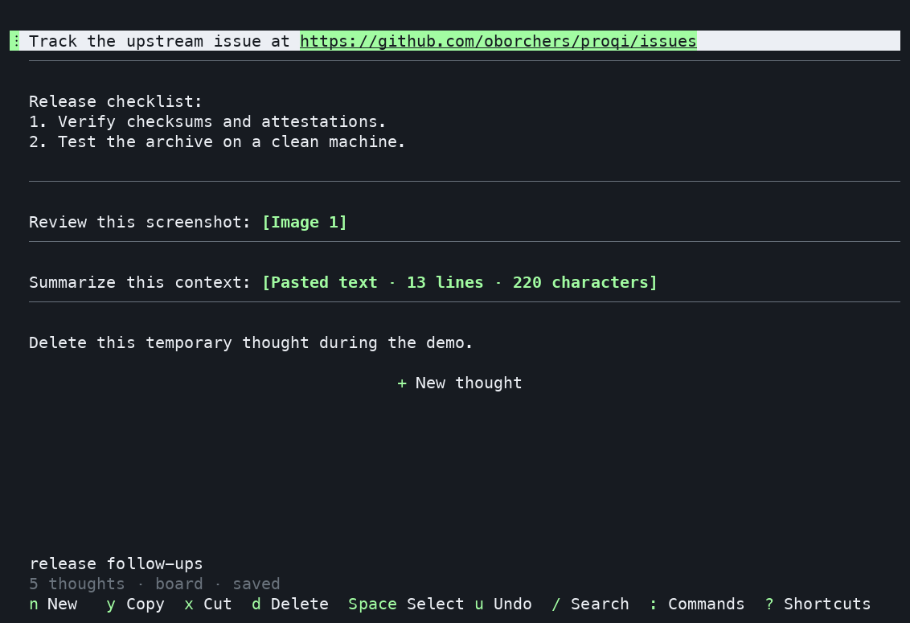
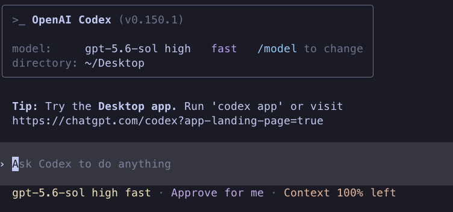
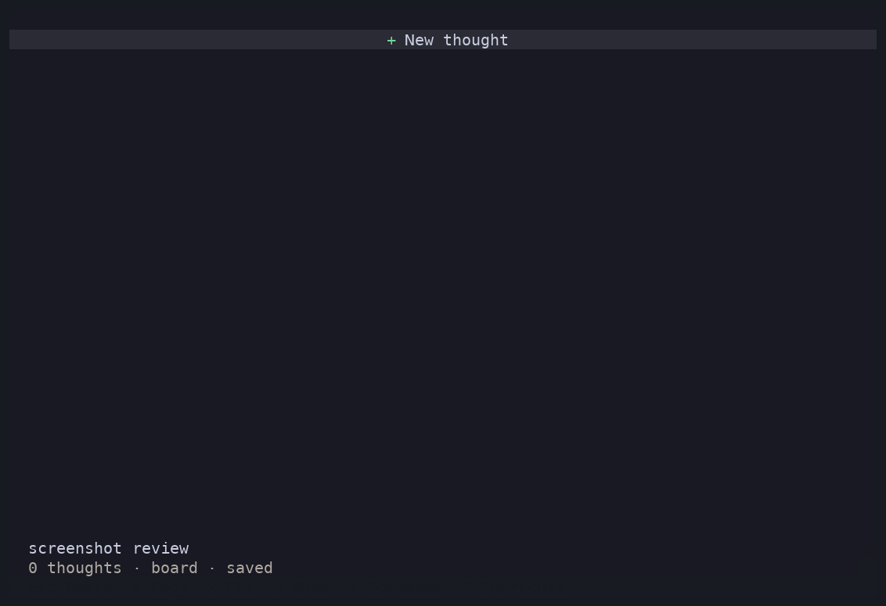
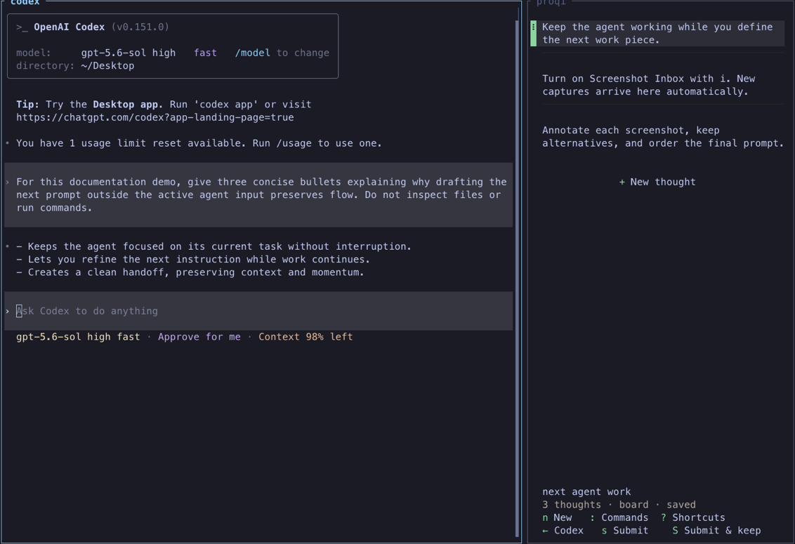

<p align="center">
  
</p>

<h1 align="center">Proqi</h1>

<p align="center">
  <code>/pɹˈə͡ʊki/</code>
</p>

<p align="center">
  <strong>The terminal-native prompt composer for power users running multiple coding agents.</strong><br>
  Serious prompting deserves more than a send box.
</p>

<p align="center">
  <a href="https://github.com/oborchers/proqi/actions/workflows/ci.yml"></a>
  <a href="https://github.com/oborchers/proqi/releases/latest"></a>
  <a href="https://github.com/oborchers/proqi/blob/main/LICENSE"></a>
  <a href="https://github.com/herdrdev/herdr"></a>
  
  
</p>

<p align="center">
  
</p>

[Why Proqi](#do-you-hate-this-editor) ·
[Workflow](#one-board-many-prompts) ·
[Install](#install) ·
[Controls](#board-controls) ·
[Screenshots](#screenshot-inbox-on-macos) ·
[Herdr](#native-submission-with-herdr) ·
[CLI](#json-cli-and-agent-skill) ·
[Privacy](#privacy-durability-and-recovery) ·
[Configuration](#configuration)

**Proqi is a terminal-native power-user prompt composer that keeps every next
instruction, screenshot, and alternative as an independent, resumable thought—
ready to refine, reorder, copy, or send to the right coding agent without
interrupting its current work.**

## Do you hate this editor?

<p align="center">
  
</p>

**Not the agent.**<br>
**The input field.**

Codex, Claude Code, and similar CLI harnesses are excellent. Their input still
belongs to one live stream. Draft the next prompt there and an agent question or
wrong turn forces you to cut it out, clear the field, steer, and paste it back.
Alternatives, later prompts, and screenshots spill into temporary files.

An unsent harness draft is not isolated from other senders either. If another
agent submits through Herdr while text is waiting in that input field, the
harness can concatenate both independent instructions and submit them as one
accidental prompt. What looked like a safe draft becomes part of another
agent's message without a distinct turn boundary.

**Proqi is the solution: an agent-ready prompt editor on steroids, built for
power users.** Capture independently; edit, select, duplicate, reorder, recover,
and discover local skills and commands later.

On macOS, the same board becomes a Screenshot Inbox. Captures arrive as private,
annotatable thoughts: no dragging across panes and no accidental drop into the
agent.

## One board, many prompts

Every thought stays editable. Keep alternatives and choose the next submission
only when ready.

1. Keep working in your terminal while coding agents continue.
2. Define each next work piece in Proqi—not in a live Codex or Claude input.
3. Capture text and screenshots, then edit, annotate, select, and order them.
4. Copy one thought, a range, or the whole board; or submit the ordered board to
   a verified adjacent agent through Herdr.

Proqi is a prompt composer—not a task manager, Markdown IDE, or agent harness.
Standalone work uses the clipboard. Native submission works **only** through
verified [Herdr](https://github.com/herdrdev/herdr), never arbitrary terminals,
agents, or multiplexers.

## Install

Homebrew is recommended:

```shell
brew install oborchers/tap/proqi
```

Scope Homebrew trust to this formula:

```shell
brew trust --formula oborchers/tap/proqi
brew upgrade --formula oborchers/tap/proqi
```

Or use Rust 1.88+:

```shell
cargo install proqi --locked
```

The [latest release](https://github.com/oborchers/proqi/releases/latest) has
checksummed macOS/Linux archives and an `amd64` Debian package. Proqi never runs
`sudo`, package managers, or updates implicitly. Uninstalling preserves data.

## Start and resume

```shell
proqi                         # new board
proqi -c                      # latest inactive board here
proqi -r                      # searchable session browser
proqi -r <id-or-name>         # exact session
proqi sessions                # list and search
```

Run `proqi -c` in the agent's project and its last board returns. No temporary
prompt files or unsaved Sublime scratch document.

Changes autosave; exit prints the resume command. Boards rename, trash, restore,
and run in parallel; one lease prevents concurrent editing.

A genuinely empty board opens with `+ Start typing`. Type or paste immediately
to create the first thought, or click the insertion row to reveal the ordinary
empty editor first. Nothing is saved until content is produced. Press `Esc` to
use Board controls instead. Returning focus to the pane does not override that
Board choice.

`Primary` means logical `Cmd` (`Super` or `Meta`) on macOS and logical `Ctrl`
elsewhere. Proqi receives modifiers only after the operating system, keyboard
remapper, and terminal have handled the key. Raw `Ctrl` is not a second Primary
modifier on macOS.

### Board controls

| Input | Action |
| --- | --- |
| `n`, `Enter` on `+ New thought`, paste, or click | Create a thought |
| `Primary+V` / `p` with no selection | Paste exactly as a new thought |
| `j` / `k` or arrows | Focus next / previous; twice at a blocked bottom / top edge creates there |
| `Enter` or `e` | Edit |
| `Primary+J` / `Primary+K`, `Primary+Shift+↓` / `↑`, or drag | Reorder |
| `Primary+C` / `y`; `Primary+X` / `x` | Copy; safe cut |
| `d` or `Del` (`Entf` on German keyboards) | Delete |
| `Space`; `Primary+A` / `a` | Toggle selection; select all |
| `Shift+↑` / `↓` or `K` / `J`; `v` then move | Extend or latch a range |
| `Primary+D` | Duplicate thought or selection |
| `Primary+Enter` / `s`; `Primary+Shift+Enter` / `S`; then arrows or `h` / `j` / `k` / `l` if needed | Submit and remove after acceptance; submit and keep |
| `Primary+Z` / `u` | Undo a board operation |
| `Primary+Shift+Z` / `Primary+Y` | **Redo a board operation** |
| `Primary+Shift+V` / `P` | Paste and reflow copied prose |
| `c`; `/`; `:`; `i`; `?` | Collapse; search; commands; Screenshot Inbox; help |
| `Esc`; `Primary+Q` / `q` | Clear selection; exit after durable flush |

### Editor controls

| Input | Action |
| --- | --- |
| `Esc` | Return to the board |
| `Primary+A`; `Primary+U` | Select all; delete logical line |
| `Primary+Shift+U` | Delete containing sentence |
| `Primary+Z`; `Primary+Shift+Z` / `Primary+Y` | Undo; redo |
| `Primary+C` / `X`; `Primary+V` | Native copy / safe cut; paste exactly |
| `Primary+Shift+V` | Paste and reflow copied prose |
| macOS: `Cmd+←` / `→` | Move to the current wrapped visual-row start / end |
| macOS: `Option+←` / `→`; elsewhere: `Ctrl+←` / `→` | Move by word |
| `Shift` + movement | Extend text selection |
| macOS: `Cmd+Shift+←` / `→` | Extend to the current wrapped visual-row start / end |
| `Home` / `End` | Move to the logical line boundary |
| `Alt+↑` / `↓` or `Page Up` / `Page Down`; `Primary+↑` / `↓` | Jump five rows; thought start / end |
| `Enter`; `Tab`; `Shift+Tab` | Continue lists; nest; outdent |
| `↑` / `↓` twice at a boundary | Focus the adjacent thought, or create at the top / bottom board edge |
| `Primary+Enter`; `Primary+Shift+Enter` | Submit and remove after acceptance; submit and keep |
| Type `$name`, `/name`, or supported `@name` | Complete a local invocation |
| `↑` / `↓` or `Primary+P` / `Primary+N`; `Enter` / `Tab`; `Esc` | Navigate, insert, or close invocation results |

Unmodified physical `Del` is an invariant Board alias. Remapping the `delete`
character changes `d`, not the physical key. Modified `Del` is not a Board
command. In text editors and searchable query fields, `Del` remains a
text-editing key, never a thought delete, and `h`, `j`, `k`, and `l` remain
literal text. List-only menus and four-way choosers ignore irrelevant modifiers
equally for arrows and their Vim-style aliases.

Standard Primary chords are the canonical commands across Board and Edit.
Configurable Board characters such as `y`, `x`, `u`, `s`, `S`, and `q` remain
portable aliases when a terminal consumes a system chord. Ghostty consumes
configured keybindings before Proqi receives input. Its macOS defaults include
the common macOS clipboard, selection, history, duplicate, submission, quit,
and Cmd-arrow chords. A host binding for `Cmd+Shift+V` may perform an ordinary
bracketed paste before Proqi can observe the chord. That paste stays exact.

To forward the chord to Proqi, add this line to Ghostty's configuration and
reload it:

```ini
keybind = super+shift+v=csi:118;10u
```

This sends the Kitty keyboard encoding for Super+Shift+V. Merely using `unbind`
is insufficient on Ghostty 1.3.1 for this Super-modified key. Proqi does not
promise delivery of intercepted chords, change Ghostty settings, or repeat a
host paste. Use `p` for exact paste or `P` for reflow on the Board, choose the
corresponding action in Commands, or run `proqi diagnostics keypress` when the
chord does not reach the application.

Exact paste is always the default. Explicit paste and reflow joins copied prose
lines, collapses repeated spaces and tabs, and reduces blank runs to one paragraph
break. It preserves recognized lists and leaves code, tables, quotes, paths,
URLs, controls, and annotated semantic ranges unchanged. Large-paste folds are
recomputed from the transformed content.

Mouse input covers the same core workflow. Images, files, and large pastes fold
into compact annotations while their content stays intact. In Edit mode, an
unmodified `Space` on one completely selected collapsed annotation inserts a
space immediately before it without replacing it. See
[invocation compatibility](docs/INVOCATIONS.md).

Inside Herdr, opening the same invocation picker also discovers recognized live
coding agents across the server. Selecting one inserts an inert collaborator
location and displays it as a compact inline mention. It never focuses or
submits to that agent.

## Screenshot Inbox on macOS

<p align="center">
  
</p>

From `+ Start typing`, press `Esc`, then `i`: new Desktop screenshots become
annotatable image thoughts. From an ordinary Board, press `i` directly. Proqi
never takes, uploads, analyzes, copies, or configures them.

One process listens. It pauses after 10 unattended captures or 20 inactive
minutes. Resume ignores the gap; failed imports require explicit retry.

macOS may request terminal **Files & Folders** access—not Screen Recording or
Accessibility. Linux reports macOS-only availability.

```toml
[screenshot_inbox]
# directory = "/absolute/path/to/an/isolated/inbox" # default: Desktop
capture_all_new_images = false
notify_terminal_on_auto_pause = false
```

## Native submission with Herdr

<p align="center">
  
</p>

In Herdr, Proqi finds verified adjacent agents. In Board mode, `s` or
`Primary+Enter` submits the selected thought or selection in visible order and
removes after acceptance; `S` or `Primary+Shift+Enter` keeps it. While editing,
the same Primary chords submit only the active thought. The palette submits the
whole board. With several verified adjacent agents, either edit
chord opens the temporary direction chooser; press an arrow or `h`, `j`, `k`,
or `l` next to choose the target. Those keys select a direction instead of
moving or inserting text while the chooser is open. `Esc` cancels the chooser
and returns to the unchanged editor.

When an accepted submission removes the final thought, Proqi returns to the
passive `+ Start typing` board. It does not create a replacement blank thought;
the next typed or pasted content creates the next thought directly.

Busy receivers decide whether input steers or queues. Any failed verification
leaves the board unchanged.

Keep deferred prompts in Proqi rather than in the native harness input when
other senders can target that agent. When two submissions overlap, the harness
may not keep them in separate turns, so text already waiting in its input can
merge with an incoming message. Proqi preserves its verified submission flow,
but it cannot separate content after the receiving harness has combined it.

Proqi never invokes a shell, injects keys, reads chats, or waits. Herdr is
optional.

Protocol 19 supports Claude Code, Codex, Pi, and Hermes.
[OpenCode](context/harnesses/opencode.md) and [Kilo](context/harnesses/kilo.md)
are conditional; Cline is deferred.

## JSON CLI and agent skill

The CLI also exposes versioned JSON:

```shell
proqi --json capabilities
printf '%s' 'Review this.' | proqi --json thoughts add <session-id>
proqi --json thoughts send <source> <thought-id> <destination> --remove
```

The [Proqi skill](skills/proqi/SKILL.md) uses it without scraping the TUI:

```shell
npx skills add oborchers/proqi --skill proqi -g --agent codex --agent claude-code
```

The skill does not install the Proqi executable. Run `capabilities` first.

For read-only-first failure investigation:

```shell
npx skills add oborchers/proqi --skill proqi-debug -g
```

## Privacy, durability, and recovery

Thoughts, attachments, settings, and redacted logs stay local. No telemetry,
cloud sync, collaboration service, or upload.

The footer reports durability. Failures block destructive exit and remain
retryable/exportable. Editor and board history survive restart.

```shell
proqi doctor
proqi diagnostics collect --output proqi-diagnostics.json
```

Diagnostics are redacted and local; review before sharing. See
[SECURITY.md](SECURITY.md). Disable content-free update checks with
`check_for_updates = false`.
Collected update diagnostics include only closed lifecycle stages, aggregate
participant and replacement counts, stable failure codes, and convergence.
Finalization diagnostics distinguish unavailable control, unavailable private
cache state, and an exact-state mismatch without recording local identifiers.

## Configuration

Optional platform-native `config.toml`:

```toml
check_for_updates = true
theme = "auto" # auto, light, dark, limited, or a bounded local theme file
density = "comfortable" # or compact
merge_separator = "\n\n" # one blank line between merged thoughts

[keybindings]
new = "n"
edit = "e"
delete = "d" # remaps the character only; physical Del remains available
submit_remove = "s"
submit_keep = "S"
undo = "u"
focus_up = "k"
focus_down = "j"
transform = "t" # merge selection; Esc,t splits or extracts the last editor range
screenshot_inbox = "i"
paste = "p" # Board p pastes exactly; its uppercase P counterpart reflows
delete_sentence = "U" # Primary+Shift+U, use another unreserved uppercase suffix to remap
select_visual_row_start = "H" # Primary+Shift+H fallback
select_visual_row_end = "L" # Primary+Shift+L fallback
```

Thought transformations are contextual and remappable. In an editor, use
`Primary+T` to split at the cursor, or to extract the
exact selection. `Esc`, then `t`, is the portable immediate fallback. On the
board, select two or more contiguous thoughts and press `t` to merge them with
the configured exact separator. The command palette exposes all three actions
for keyboard and mouse discovery. If an older config already assigns plain `t`
to another board action, that established action keeps precedence and the
footer omits the shadowed board spelling until `transform` is remapped. The
Primary chord and command-palette actions remain available. Bindings reserved
for established Primary shortcuts are rejected instead of silently disabling
the configured transformation chord.

Unsafe theme contrast is rejected. See the
[theme example](docs/themes/proqi-dark.toml). Invocation roots stay local.
Sentence deletion uses a documented Unicode profile with unavoidable ambiguity.
See [sentence deletion](docs/SENTENCE_DELETION.md).
Visual-row selection uses the current rendered width and folded presentation.
On macOS, Cmd plus horizontal arrows uses the current wrapped row and
Option retains word movement. Elsewhere, Ctrl plus horizontal arrows retains
word movement, including with Shift. If the terminal intercepts the macOS
Cmd-arrow selection chords, use the command palette or the configured
shifted Primary suffixes above.

## Compatibility and contributing

Proqi supports macOS and x86-64 GNU/Linux; only the latest `0.x` is supported.
It is an MIT-licensed binary. Contributors: [CONTRIBUTING.md](CONTRIBUTING.md),
[PRODUCT.md](context/PRODUCT.md), [ARCHITECTURE.md](context/ARCHITECTURE.md).

```shell
cargo build --locked
cargo run --bin proqi
cargo xtask check # canonical local gate
```

The demos use the release binary; the assets gate checks dimensions, links, and
privacy.
