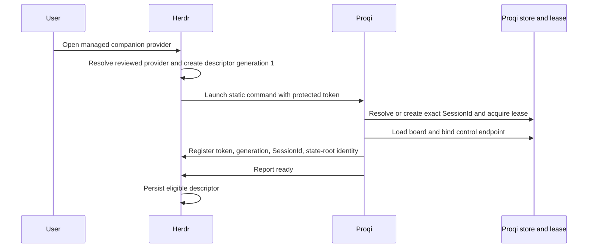
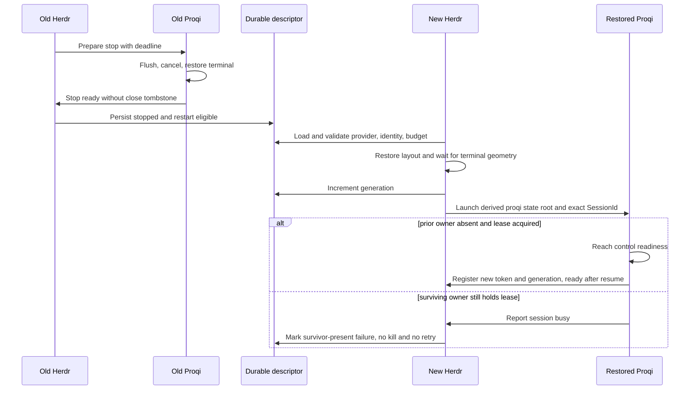
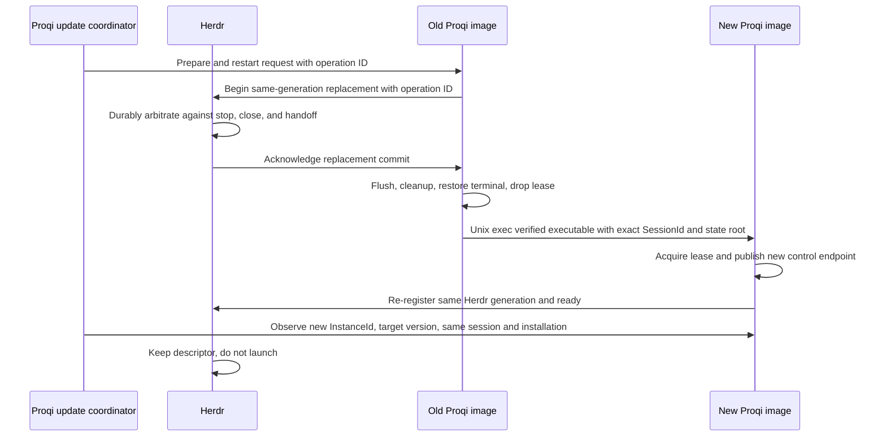
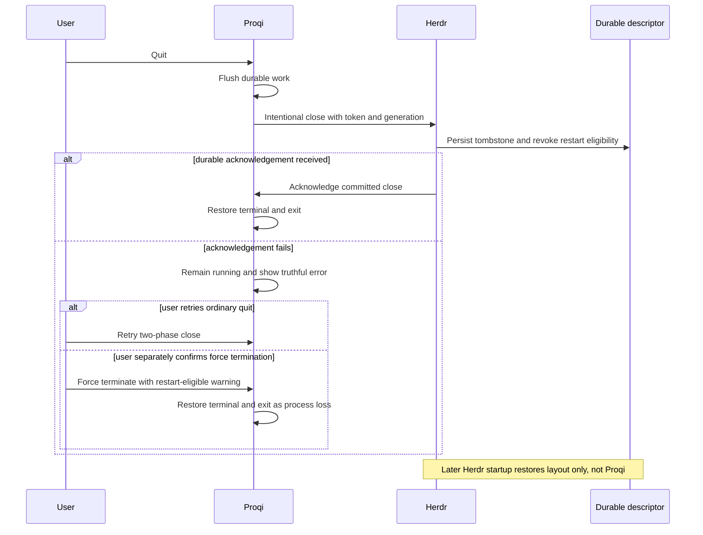

# Herdr managed Proqi lifecycle spike

## Executive verdict

Herdr 0.8.2 cannot safely make Proqi restartable through its current plugin,
integration, pane self-reporting, or agent APIs. The supported cold restart path
is a closed native-harness contract. It accepts a session reference only from a
hardcoded source and agent string pair and maps that reference to a hardcoded
harness resume command. Those strings are not provenance-authenticated.
Workflow plugins can declare commands, panes, startup hooks, actions,
and event hooks, but cannot define an agent kind or a supervised process
lifecycle.

The recommended path is one small upstream Herdr capability: a typed managed
companion role that is explicitly separate from semantic prompt agents. Herdr
would own a reviewed launch descriptor, bind one running process to one restored
pane, persist only validated identity fields, and run a bounded restart state
machine. Proqi would report its exact `SessionId`, safe state-root identity,
readiness, intentional close, and update handoff under a Herdr-issued launch
token. It would keep its existing session lease as the final duplicate-owner
barrier.

Do not pretend Proqi is Codex, Claude, or another harness. That would select the
wrong executable and argv on restore, expose Proqi to agent prompt semantics,
apply the wrong screen and status model, corrupt update ownership, and depend on
private implementation details that can drift without notice.

No production behavior was implemented in this spike.

## Scope and evidence baseline

This document evaluates one exact baseline:

| Item | Verified value |
| --- | --- |
| Proqi repository base | `230fd1f59db68e4ca892072802738eeb6a6f7e60` |
| Proqi branch | `docs/herdr-agent-like-spike` |
| Installed Herdr | `0.8.2` |
| Installed protocol | `20`, schema `1` |
| Herdr release tag | annotated tag object `34ba52cc6ff3b723e6fc0130485ec24582dbe205` |
| Herdr release commit | `9eb521456ac0d19d3ab3d9d7cea3cca10baa8a4c` |
| Herdr source license | MIT |

The Herdr tag and peeled commit were verified with `git ls-remote`. The exact tag
was cloned read-only and remained clean. Public CLI help, `herdr --skill`,
`herdr api schema --json`, default configuration, and the `status`, `agent`,
`pane`, `integration`, `plugin`, `workspace`, `session`, and `worktree` surfaces
were inspected. No user pane content or private configuration was used as
evidence.

Primary Herdr references are the immutable
[`v0.8.2` release](https://github.com/herdrdev/herdr/releases/tag/v0.8.2), the
exact
[`agent_resume.rs`](https://github.com/herdrdev/herdr/blob/9eb521456ac0d19d3ab3d9d7cea3cca10baa8a4c/src/agent_resume.rs#L53-L69),
[`snapshot.rs`](https://github.com/herdrdev/herdr/blob/9eb521456ac0d19d3ab3d9d7cea3cca10baa8a4c/src/persist/snapshot.rs#L311-L371),
[`restore.rs`](https://github.com/herdrdev/herdr/blob/9eb521456ac0d19d3ab3d9d7cea3cca10baa8a4c/src/persist/restore.rs#L446-L666),
and the versioned
[`session-state.mdx`](https://github.com/herdrdev/herdr/blob/9eb521456ac0d19d3ab3d9d7cea3cca10baa8a4c/docs/preview/website/src/content/docs/session-state.mdx#L29-L97).

## Terms in Herdr 0.8.2

These terms are similar in ordinary language but have different concrete
owners in Herdr:

| Term | Exact meaning in 0.8.2 |
| --- | --- |
| Agent | A recognized coding-agent process currently controlling a pane. It has a known or reported label and a lifecycle status. A pane exists independently of an agent. |
| Agent kind | One member of Herdr's closed 22-variant `detect::Agent` enum. It selects a canonical executable for `agent start`. Twenty kinds use screen manifests; Omp and Mastracode instead rely on integration hook authority for status. |
| Recognized process | A pane occupant identified through known executable and screen detection, OSC data, or a report. Recognition normally supports agent listing and status. In 0.8.2, an unauthenticated report that claims one allowlisted source and agent spelling can also create restart authority, which is a security weakness rather than a safe registration contract. |
| Restartable pane | There is no public type with this name. In cold restore, it is effectively a saved pane containing a valid, nonduplicated allowlisted agent session reference for which `agent_resume::plan` returns a hardcoded argv. |
| Resumable harness | A supported known agent whose source, agent, reference kind, and resume argv are hardcoded in Herdr. Its integration normally reports the native session reference, but 0.8.2 does not authenticate that provenance. |
| Integration | A built-in Herdr installer for hooks or plugins inside a supported third-party harness. It reports session or lifecycle data back to Herdr. It is distinct from a Herdr workflow plugin. |
| Plugin | A trusted local workflow package with a `herdr-plugin.toml`. Version 1 exposes build commands, startup hooks, actions, event hooks, panes, and link handlers. The plugin owns its code and durable state. |

The closed agent set and canonical executables are visible in
[`detect/mod.rs`](https://github.com/herdrdev/herdr/blob/9eb521456ac0d19d3ab3d9d7cea3cca10baa8a4c/src/detect/mod.rs#L41-L180).
The public automation documentation makes the pane and agent separation
explicit and says `--kind` selects a supported agent and canonical executable
in
[`agent-automation.mdx`](https://github.com/herdrdev/herdr/blob/9eb521456ac0d19d3ab3d9d7cea3cca10baa8a4c/docs/preview/website/src/content/docs/agent-automation.mdx#L8-L46).

## Verified current Herdr behavior

### Persistence and resurrection ownership

The Herdr server owns the structural session snapshot and cold restoration. A
snapshot stores workspace, tab and pane layout, focus, pane cwd, label, optional
managed-agent metadata, optional official agent session identity, and a captured
`launch_argv`. The saved `launch_argv` is used to describe a live imported
handoff runtime. It is not executed during an ordinary cold restore. In the
cold path, Herdr creates a fresh shell unless a native agent restore plan exists.
The conditional use of saved argv only for `was_imported` is in
[`restore.rs` lines 628 through 650](https://github.com/herdrdev/herdr/blob/9eb521456ac0d19d3ab3d9d7cea3cca10baa8a4c/src/persist/restore.rs#L628-L650).

For native agent restore, Herdr persists the accepted session reference, builds
the resume plan, waits for terminal geometry and theme context, starts a shell
in the saved cwd, and submits the shell-encoded hardcoded resume argv. The launch
path is in
[`app/agent_resume.rs`](https://github.com/herdrdev/herdr/blob/9eb521456ac0d19d3ab3d9d7cea3cca10baa8a4c/src/app/agent_resume.rs#L205-L285).
The plugin does not own this operation. The harness owns its conversation data,
while Herdr owns the decision and launch.

The default configuration has `session.resume_agents_on_restore = true` and
`experimental.pane_history = false`. Public documentation states that a server
restart restores layout, but not shells, servers, tests, or arbitrary processes.
Only native agent session restore can restart an eligible conversation. Screen
history is a separate, opt-in rendering replay and is not a process restart.

### What qualifies for restart

Cold restart is not limited to agents originally launched by `herdr agent
start`. It is also not granted by `agent start` alone. The implemented qualifier
is a valid native session reference reported with an allowlisted source and
agent string pair, plus a matching hardcoded resume plan. `agent start` owns supported-kind launch,
name assignment, detection, and the readiness wait. Its argv is a canonical
executable plus caller arguments, but those original arguments are not a generic
cold-restart descriptor. See
[`app/agents.rs`](https://github.com/herdrdev/herdr/blob/9eb521456ac0d19d3ab3d9d7cea3cca10baa8a4c/src/app/agents.rs#L145-L226).

`session_ref_from_report` first checks `is_official_agent_source`. The allowlist
is a closed match of literal source and agent pairs. The report handlers pass
caller-supplied `source` and `agent` values directly to this check. They do not
authenticate integration provenance or require a launch token. Therefore
"official" in this code means nominal source spelling, not a verified official
reporter. `plan` maps accepted pairs to specific commands such as `codex resume
<id>` and `claude --resume <id>`. References are deduplicated by source, agent,
reference kind, and value. See
[`app/api/panes.rs` lines 1231 through 1282](https://github.com/herdrdev/herdr/blob/9eb521456ac0d19d3ab3d9d7cea3cca10baa8a4c/src/app/api/panes.rs#L1231-L1282) and
[`agent_resume.rs` lines 118 through 247](https://github.com/herdrdev/herdr/blob/9eb521456ac0d19d3ab3d9d7cea3cca10baa8a4c/src/agent_resume.rs#L118-L247).

Consequences:

1. A manually started supported harness can be resumed if a report claims an
   accepted native source, agent, and session reference tuple. Normally its
   integration sends that report, but 0.8.2 does not prove the caller is that
   integration.
2. An `agent start` process without an accepted session reference returns as a
   shell after cold restart.
3. An arbitrary command, including one with captured `launch_argv`, returns as a
   shell after cold restart.
4. Duplicate, invalid, stale, missing, or unsupported references return as
   shells. Herdr does not guess.

The 17 kinds with a native cold-resume plan are Claude, Codex, Copilot, Devin,
Droid, Kimi, Mastracode, Pi, Omp, Hermes, OpenCode, Qoder CLI, Qwen, Kilo,
Cursor, Antigravity, and Grok. The other five supported agent kinds, Gemini,
Cline, Kiro, Amp, and Maki, have no native resume plan in 0.8.2. A supported
`agent start` kind is therefore not necessarily a resumable harness.

### Plugins are not agent-kind providers

The exact 0.8.2 raw manifest has only these entrypoint collections:
`build`, `startup`, `actions`, `events`, `panes`, and `link_handlers`. There is no
agent-kind, detection, readiness, status, shutdown, restart, or resume field in
[`plugins/manifest.rs`](https://github.com/herdrdev/herdr/blob/9eb521456ac0d19d3ab3d9d7cea3cca10baa8a4c/src/app/api/plugins/manifest.rs#L11-L86).

Plugin panes launch a manifest-owned argv and receive plugin and Herdr context.
Herdr records plugin pane ownership in live state and schedules the ordinary
session snapshot. The cold snapshot contains the pane label and launch argv,
but the plugin ownership record is not a cold-restart process contract. The
ordinary restore path still starts a shell.

Startup hooks run once after restore and socket readiness, asynchronously. They
also run after live handoff, do not run on attach, configuration reload, link,
or enable, and a failure does not stop the server. The documentation explicitly
calls them one-shot initialization rather than supervised daemons in
[`plugins.mdx`](https://github.com/herdrdev/herdr/blob/9eb521456ac0d19d3ab3d9d7cea3cca10baa8a4c/docs/preview/website/src/content/docs/plugins.mdx#L233-L249).

Plugin event hooks cover workspace, worktree, tab, pane, and agent observation
events. There is no pre-shutdown, restart-plan, restore-claim, readiness,
cancellation, or retry-policy hook. The exact allowlist is in
[`events.rs`](https://github.com/herdrdev/herdr/blob/9eb521456ac0d19d3ab3d9d7cea3cca10baa8a4c/src/api/schema/events.rs#L286-L309).

These six manifest entrypoint collections are the documented public plugin-v1
surface. Plugins declare `min_herdr_version`, and Herdr documents the CLI or
socket callback surface as stable; the socket API separately negotiates its
protocol version. No documented public or stable lifecycle-provider contract
exists. Adding `managed_companions` would therefore be a new versioned upstream
surface, not an interpretation of an existing hook. See the versioned
[`plugins.mdx` contract](https://github.com/herdrdev/herdr/blob/9eb521456ac0d19d3ab3d9d7cea3cca10baa8a4c/docs/preview/website/src/content/docs/plugins.mdx#L1-L20).

A startup hook could keep plugin-owned records and issue pane commands after a
restart. That is not sufficient here. It would race Herdr's restored shells,
could create duplicate panes, lacks an atomic intentional-close tombstone, has
no trusted binding to the former pane process, and would place lifecycle and
retry policy in a one-shot workflow script. It would be an external supervisor
implemented inside a plugin, not a public Herdr restart contract.

### Self-reporting recognition and the nominal-source restart weakness

`pane report-metadata` is presentation-only. Proqi currently uses it for title
and display-agent metadata with a process-unique source, monotonic sequence, a
15-second TTL, a 10-second refresh, and a best-effort clear on shutdown. It does
not claim agent or restart identity. See
[`src/adapters/herdr/mod.rs`](../src/adapters/herdr/mod.rs) and
[`src/adapters/terminal/runner/heartbeat.rs`](../src/adapters/terminal/runner/heartbeat.rs).

`pane report-agent` can expose an arbitrary custom label and reported lifecycle
state. It cannot add a new `detect::Agent` kind, so the truthful label `proqi`
remains unknown. A custom-source report that uses an existing label such as
`codex` can affect effective known-agent classification because Herdr parses the
reported label. A session reference attached to that custom source is still
discarded by the official-source check and is not snapshotted as native resume
authority. `agent.prompt` separately requires an effective known agent and
verifies that the matching expected process still owns the foreground, so a
label alone does not bypass prompt routing. Effective-label parsing is in
[`terminal/state.rs`](https://github.com/herdrdev/herdr/blob/9eb521456ac0d19d3ab3d9d7cea3cca10baa8a4c/src/terminal/state.rs#L1807-L1814). The routing gate is in
[`app/api/agents.rs`](https://github.com/herdrdev/herdr/blob/9eb521456ac0d19d3ab3d9d7cea3cca10baa8a4c/src/app/api/agents.rs#L62-L109).

`pane report-agent` and `pane report-agent-session` can establish native restart
ownership if any caller spoofs an allowlisted pair such as `herdr:codex` and
supplies an accepted session reference. The handlers have no provenance check.
This is not a safe public registration contract because restore then runs the
hardcoded command for the impersonated harness. It is evidence that restart
authority in 0.8.2 is nominally gated, not evidence that Proqi should use it.

Thus status classification and prompt capability are partly separable today,
but restartability is not safely and independently expressible. Proqi can
self-report as a custom agent-like occupant without becoming a valid prompt
target, yet a truthful custom report cannot acquire cold-restart ownership. It
should not spoof an allowlisted agent to obtain restart behavior.

### Protocol surface

The installed schema is schema version 1, protocol 20. It exposes fixed
`agent.*`, `pane.report_agent`, `pane.report_agent_session`,
`pane.report_metadata`, `plugin.*`, and session snapshot operations. It exposes
no generic managed-process registration, provider declaration, durable launch
descriptor, intentional-close tombstone, generation claim, or restore result.

Proqi's existing semantic prompt integration qualifies protocol 19 and 20 from
recorded fixtures and accepts one structurally compatible provisional protocol
21. It validates the exact `agent.prompt` request and response shape. See
[`src/adapters/herdr/compatibility.rs`](../src/adapters/herdr/compatibility.rs).
That policy must not imply support for a future lifecycle API. Managed companion
support needs its own capability and fixture gate.

## Isolated experiment

One named session, `proqi-agent-like-spike-082`, ran with a temporary config,
temporary XDG config and state roots, `allow_nested = true`, native agent resume
enabled, and pane history disabled. The fixture programs only printed their
argv and waited for termination. No live user server, workspace, pane, plugin,
or integration was changed.

| Fixture | Launch and report path | Saved evidence before stop | Result after cold restart and client geometry |
| --- | --- | --- | --- |
| Arbitrary process | `pane run`, executable `fixture arbitrary` | Pane cwd only, no session reference | Fresh `zsh` in saved cwd |
| Custom self-report | `pane run` of executable named `proqi`, then `report-agent` from `local:proqi-fixture` with state and a synthetic `SessionId` | Appeared in `agent list` as `proqi`; session reference absent from snapshot | Fresh `zsh`; custom agent identity gone |
| Supported agent launch plus nominally official report | `agent start --kind codex`, synthetic executable named `codex`, then unauthenticated `report-agent-session` claiming `herdr:codex` | Allowlisted `codex` session reference persisted | Relaunched as exact argv `codex resume codex-fixture-session` |
| Plugin pane | Linked local plugin with one `[[panes]]` argv and opened it as a tab | `launch_argv` persisted as `.../proqi plugin`; no native session reference | Fresh `zsh` in plugin cwd; saved argv not executed |
| Prompt boundary | `agent prompt` against the custom reported Proqi fixture | No text accepted | Rejected as not an active named agent |

The experiment proves both halves of the boundary. A captured command and a
recognized custom label are insufficient. An unauthenticated report claiming an
allowlisted source and agent pair is sufficient even though the synthetic
`agent start` readiness wait reported blocked and never completed as a ready
managed launch. The cold path used the hardcoded native resume plan, not the
original launch record. This proves both the exact mechanism and why it is
unsafe as general restart authority.

## Current Proqi lifecycle facts

Proqi already owns the durable board and much of the safety boundary that a
Herdr lifecycle layer should reuse:

1. `proqi -r <ID_OR_NAME>` resolves a typed `SessionId`; update replacement uses
   the exact canonical ID, not a name. `--state-dir <absolute-path>` selects an
   isolated state root. See [`src/cli/args.rs`](../src/cli/args.rs) and
   [`src/cli/execute.rs`](../src/cli/execute.rs).
2. `SessionService::resume` acquires the authoritative session lease before
   loading and rehydrating the session. A conflicting process returns the typed
   `session_busy` failure. See
   [`src/application/service/sessions.rs`](../src/application/service/sessions.rs).
3. `FileRuntimeCoordinator` uses one exclusive OS file lock per `SessionId`.
   JSON instance metadata is descriptive only. A scan proves liveness through
   the lock, removes stale metadata and control sockets, and never force-unlocks
   a live owner. See [`src/adapters/runtime/mod.rs`](../src/adapters/runtime/mod.rs).
4. Live metadata includes `InstanceId`, `SessionId`, PID, version, storage and
   control protocols, control endpoint, update installation identity, launch
   directory, and start time. The user-only Unix control endpoint is published
   only after binding succeeds. See
   [`src/ports/runtime.rs`](../src/ports/runtime.rs) and
   [`src/adapters/runtime/control_endpoint.rs`](../src/adapters/runtime/control_endpoint.rs).
5. Proqi's control protocol is version 7. Requests and responses are bounded,
   and server shutdown shares a two-second process cleanup deadline. Worker
   cancellation is idempotent and child processes have bounded TERM, KILL, and
   reap behavior. See [`src/ports/control.rs`](../src/ports/control.rs),
   [`src/adapters/terminal/supervisor.rs`](../src/adapters/terminal/supervisor.rs),
   and [`src/adapters/process/owned_child.rs`](../src/adapters/process/owned_child.rs).
6. Terminal ownership is RAII-based. Normal finish, entry failure, drop, and the
   owner panic hook attempt full terminal restoration. See
   [`src/adapters/terminal/control.rs`](../src/adapters/terminal/control.rs).
7. After a verified Homebrew update, each accepted Proqi process flushes and
   cleans up, drops the lease, verifies the new installation identity and
   version, then uses Unix `exec` with `--state-dir` when present and `-r` with
   the exact `SessionId`. See
   [`src/adapters/terminal/runner/restart.rs`](../src/adapters/terminal/runner/restart.rs)
   and [`src/adapters/process/mod.rs`](../src/adapters/process/mod.rs).
8. Update convergence distinguishes the old `InstanceId` from a replacement,
   requires the same `SessionId`, target version, installation identity, and a
   ready control endpoint, and waits at most ten seconds. See
   [`src/adapters/runtime/update.rs`](../src/adapters/runtime/update.rs) and
   [`src/application/update_coordination.rs`](../src/application/update_coordination.rs).

These facts mean Herdr must resume the exact Proqi session and state root, then
let Proqi's lease decide final ownership. Cwd, title, pane label, process name,
or most-recent-session ranking are not board identity.

## Decision matrix

`Low`, `medium`, and `high` describe implementation or maintenance cost. Safety
and fidelity columns describe the resulting quality.

| Option | Implementation size | Upstream dependency | Semantic truthfulness | Identity safety | Restart fidelity | Update interaction | Portability | Maintenance | Verdict |
| --- | --- | --- | --- | --- | --- | --- | --- | --- | --- |
| Current plugin registration and startup hook | Medium plugin, small Proqi | None | Mixed, plugin is truthful but acts as an ad hoc supervisor | Weak, plugin must recreate pane binding and state rules | Low, races restored shells and can duplicate layout | Weak, no pre-shutdown or handoff protocol | Medium | High | Reject as insufficient |
| Public `report-agent` or `report-metadata` self-reporting | Small | None | Metadata is truthful; agent label or allowlisted-source spoof is misleading | Medium for display; unsafe nominal allowlist for restart | None for custom reports; wrong harness restore if spoofed | Neutral until spoofed, then unsafe | High | Low until protocol drift | Keep display metadata only; reject allowlist spoofing |
| Wrapper or pretend supported harness | Medium | None initially | False | Unsafe | Accidentally high until drift or failure | Unsafe | Low | Very high | Reject explicitly |
| Upstream typed managed companion | Medium Herdr, small to medium Proqi | Yes | High | High | High | High with explicit coordination | High once implemented on supported platforms | Medium | Recommend |
| Proqi-owned external supervisor | Medium to high | None | High about process role | Medium | Low inside Herdr because it cannot reclaim the exact restored pane atomically | Conflicting supervisors | Low to medium | High | Reject for product path |
| Manual restart | None | None | High | High | Manual only | Simple | High | Low | Safe fallback until upstream exists |

## Rejected pretend-harness path

Pretending to be Codex, Claude, or any other supported kind is unsafe and
misleading for specific, observable reasons:

| Failure | Concrete effect |
| --- | --- |
| Wrong argv | A `herdr:codex` report always becomes `codex resume <id>`; a Claude report becomes `claude --resume <id>`. Neither launches `proqi -r <SessionId>`. |
| Wrong executable ownership | `agent start --kind` chooses Herdr's canonical harness executable. PATH substitution or a wrapper would hijack an executable identity expected to mean another product. |
| Wrong prompt routing | A known agent is eligible for `agent.prompt` after status and foreground checks. Proqi is a prompt source and board, not a semantic prompt target. Input could enter its editor as unintended content or activate UI commands. |
| Wrong status parsing | Screen manifests and hook arbitration model harness thinking, idle, blocked, and done states. Proqi durability, editing, control readiness, and update states do not have those meanings. |
| Wrong resume semantics | A harness conversation ID or path is not a Proqi `SessionId` plus explicit state root. Encoding both into one string would violate validation and become a private convention. |
| Wrong update handoff | Herdr would believe a harness conversation is being resumed while Proqi may be performing its own verified same-pane `exec`. The two owners cannot prove which replacement is authoritative. |
| Wrong process ownership | Known-agent validation expects the declared harness to own the pane foreground. A wrapper creates ambiguous parent, child, argv0, and replacement behavior. |
| Protocol drift | Official source pairs, canonical executable names, screen manifests, hook precedence, and resume argv are internal closed sets. Any release can change them for the real harness without considering Proqi. |
| Support and telemetry confusion | Agent lists, errors, docs, integration status, and user expectations would all describe the wrong product and remediation. |

The 0.8.2 source requires both an allowlisted source spelling and matching agent
label before accepting native session state, but does not authenticate the
reporter's provenance. A Proqi wrapper could exploit that nominal check. Doing
so would turn a current authorization weakness into product architecture and
would still select the impersonated harness's hardcoded executable and resume
semantics. It is explicitly rejected.

## Recommended architecture

### Smallest general upstream capability

Add a `managed_companion.v1` capability to Herdr. A companion is a terminal
application that Herdr may launch, supervise, persist, and restore, but never
route through `agent.prompt`. It is not a new `detect::Agent` variant and does
not reuse `agent_status`.

The provider can initially be declared by an installed, enabled plugin, because
plugin installation is already an explicit user trust action. The new manifest
entry should be static and reviewable:

```toml
[[managed_companions]]
id = "board"
title = "Proqi"
platforms = ["macos", "linux"]
identity_schema = "proqi-session-v1"
launch_fields_schema = "proqi-launch-v1"
restart_policy = "on-restore-and-crash"
readiness_timeout_ms = 10000
shutdown_timeout_ms = 2000
max_restarts = 3
restart_window_ms = 600000

[managed_companions.executable]
resolver = "installation-record"
package_id = "proqi"
artifact = "bin/proqi"
identity_policy = "canonical-path-and-digest"
```

This is a proposed upstream manifest, not a field accepted by 0.8.2. The
provider entry owns executable selection and policy. `installation-record` is a
new typed resolver contract, not a `PATH` search: Herdr resolves a canonical
artifact from an explicitly enabled package installation and validates its
recorded package identity and digest before every launch. A plugin-relative
resolver could be a second safe variant if it canonicalizes beneath the trusted
plugin root and validates a manifest digest. A child may report values
conforming to `identity_schema`, but may never supply the command, arbitrary
argv, environment, resolver, or restart policy. Launch fields and the few
nonsecret environment values are closed, provider-schema values from which
Herdr derives argv and environment.

Add a separate API namespace, gated by an explicit schema capability. Requests
from Proqi or a user client to Herdr are:

```text
managed.open(provider_id, placement, launch_fields)
managed.register(pane_id, launch_token, generation, identity, readiness)
managed.status(pane_id, launch_token, generation, state, reason_code)
managed.begin_replace(pane_id, launch_token, generation, operation_id)
managed.stop_ready(pane_id, launch_token, generation)
managed.intentional_close(pane_id, launch_token, generation)
managed.restore_retry(pane_id)
managed.get/list
```

Herdr sends lifecycle requests to Proqi over a transient authenticated duplex
channel:

```text
lifecycle.prepare_stop(descriptor_id, generation, request_id, reason, deadline_ms)
```

Herdr creates a private per-pane socket or inherited duplex file descriptor at
launch. Its address, peer credentials, and high-entropy launch token are
transient and never enter the durable descriptor or logs. Both sides bind every
message to descriptor ID, generation, request ID, and the verified foreground
process lineage. Only Herdr sends lifecycle requests. Proqi sends idempotent
acknowledgements and the `managed.*` reports above. EOF means infrastructure
interruption, so Proqi performs bounded flush and terminal restoration without
an intentional-close tombstone. Missing, stale, malformed, or late messages
fail closed. A prepare timeout moves the descriptor to failed and invokes
bounded Herdr-owned process cleanup; it does not wait indefinitely.

`managed.begin_replace` is the transactional commit for a Proqi update. Herdr
durably accepts or rejects it before Proqi may `exec`. An accepted operation ID
permits exactly one same-generation re-registration on the same authenticated
channel and process lineage. This makes update arbitration implementable rather
than overloading advisory status.

`managed.open` is the normal authority-creating operation. Herdr resolves and
validates the static provider from its installed registry, validates typed
`launch_fields`, derives cwd, argv, and an allowlisted environment, creates the
pane, issues a high-entropy launch token in protected environment, binds it to
the pane's foreground process lineage, and records the initial descriptor. No
raw argv or environment map crosses this API. A narrow
adoption operation may be added later only if it verifies all of the following:

1. The call is `--current` from the target pane's protected Herdr context.
2. The reporter is the pane foreground process or its verified descendant.
3. The executable matches the installed provider identity.
4. The state root came from an approved launch field or matches a provider-owned
   canonical root policy.
5. The child supplies no executable, command, unbounded argument, or environment
   value.

Without all five, an untrusted child could turn display metadata into arbitrary
code execution on the next server start.

### Durable launch descriptor

Herdr should persist one typed descriptor per managed companion pane:

| Field | Durability | Rule |
| --- | --- | --- |
| Descriptor ID | Durable | Herdr-generated typed ID, never inferred from pane title |
| Provider ID and provider version | Durable | Resolves the reviewed manifest entry; fail incompatible if missing or changed incompatibly |
| Provider manifest digest | Durable | Detects unreviewed command contract changes; migration must be explicit |
| Logical workspace, tab, and pane slot | Durable Herdr layout | Placement only, never board identity |
| Proqi `SessionId` | Durable | Exact validated prefixed UUIDv7, the board identity and dedupe key component |
| State-root identity | Durable | Canonical private root or provider-defined default sentinel; never inferred from cwd |
| Installation identity | Durable | Provider or package identity, not merely argv0; re-resolve current executable on restore |
| Launch cwd | Durable | Restores process context only; never selects a session |
| Approved launch options | Durable | Typed values created by Herdr or validated against provider schema |
| Environment allowlist | Durable | Only named nonsecret values required by the provider; do not persist the inherited environment |
| Restart generation | Durable | Monotonic number incremented before each Herdr-owned launch |
| Restart budget window | Durable or reconstructible | Count and timestamps sufficient to stop loops across server restarts |
| Intentional-close tombstone | Durable | Written before the descriptor becomes ineligible for restore |
| Last compatible provider schema | Durable | Fail closed after incompatible provider or protocol changes |
| PID, Proqi `InstanceId`, control socket, launch token, readiness, terminal geometry | Transient | Re-established for every process generation |

Prompt content, board text, terminal history, arbitrary environment variables,
secrets, and child-supplied commands must never enter this descriptor. Proqi's
SQLite store remains the only durable board-content owner.

The restore argv for this provider is derived, not stored as a child command:

```text
<resolved verified proqi executable>
  [--state-dir <validated exact root>]
  -r <exact SessionId>
```

Herdr injects the new descriptor ID, generation, and launch token through
protected environment. Terminal geometry remains owned by Herdr's restored
layout and is applied before readiness. A public pane ID may change during
restore or movement and is refreshed from Herdr; it is not persisted as Proqi
identity.

### Proqi changes

Proqi needs a separate optional lifecycle adapter, not additions to its semantic
prompt gateway:

1. Detect `managed_companion.v1` independently of protocols 19 through 21 and
   validate its exact schema.
2. After resolving or creating the session, acquiring the session lease,
   loading SQLite, binding owner control, and entering a usable terminal,
   register the exact `SessionId`, state-root identity, generation, and ready
   state using Herdr's protected launch token.
3. On Herdr prepare-stop, cancel new work, flush persistence, restore terminal
   state as appropriate, acknowledge readiness within the existing shared
   two-second shutdown budget, and exit without writing an intentional-close
   tombstone.
4. On explicit UI quit, ask Herdr to persist the intentional-close tombstone
   before final process exit. This is a two-phase operation. Ordinary managed
   quit exits only after durable Herdr acknowledgement. If acknowledgement
   fails, Proqi remains running, shows a truthful error, and retries only after
   explicit user action. A separate forced-termination action must warn that
   the descriptor remains restart eligible and is classified as process loss,
   not intentional close.
5. Around Proqi's own update `exec`, report a same-generation replacement
   transition. Re-register ready after the new image has acquired the same
   session lease and published its new control endpoint.
6. Treat a stale generation or launch token as incompatible and do not claim
   the pane. Keep the existing lease authoritative if two starts race.

No board schema change is required. A small durable intentional-close fallback
inside Proqi may be considered only if upstream cannot atomically acknowledge
close, but it must be scoped to one Herdr descriptor and generation so it does
not disable ordinary manual resume.

## Lifecycle state machine

The lifecycle state is owned by Herdr. Proqi reports evidence for transitions,
but cannot grant itself launch authority.

| State | Meaning | Permitted transitions |
| --- | --- | --- |
| `unregistered` | A process may exist, but no trusted descriptor binds it to this pane | `registered`, `intentionally_closed` |
| `registered` | Launch token, generation, foreground lineage, provider, and identity validate; application is not yet ready | `ready`, `failed`, `incompatible`, `stopping_for_herdr_handoff` |
| `ready` | Exact Proqi session lease is held, durable store loaded, terminal usable, and control readiness published | `registered` for same-generation Proqi `exec`, `stopping_for_herdr_handoff`, `stopped`, `intentionally_closed`, `failed` |
| `stopping_for_herdr_handoff` | Herdr requested bounded quiescence for server stop or cold handoff | `stopped`, `failed`; live handoff may return to `ready` without process replacement |
| `stopped` | No live process owns the descriptor, and restart eligibility remains | `restoring`, `intentionally_closed`, `incompatible` |
| `restoring` | Herdr incremented generation and launched the provider-derived exact resume command | `registered`, `ready_after_resume`, `failed`, `incompatible` |
| `ready_after_resume` | The replacement proved exact session ownership and full readiness | `ready`, `registered` for Proqi update, `stopping_for_herdr_handoff`, `intentionally_closed`, `failed` |
| `intentionally_closed` | Durable tombstone or user-owned pane/workspace close revoked restart eligibility | Terminal state; a new explicit `managed.open` creates a new descriptor |
| `failed` | Launch, readiness, cleanup, or runtime failed | `restoring` only within budget or after explicit user retry; otherwise remains failed |
| `incompatible` | Provider, executable identity, schema, protocol, state root, or descriptor cannot be validated | Explicit migration, provider repair, or manual open only |

`ready_after_resume` is an observable milestone, then normal operation becomes
`ready`. It exists so acceptance tests and update convergence can prove that a
replacement, not merely a spawned PID, owns the exact board.

### Event policy

| Event | Required result |
| --- | --- |
| Explicit Proqi quit | Persist intentional-close tombstone and wait for durable acknowledgement before exit. On acknowledgement failure, remain running and show an error. A separately confirmed force exit remains restart eligible and is process loss, not intentional close. |
| Herdr clean shutdown | Prepare and flush within a bound, retain descriptor, stop, restore on next start |
| Herdr server crash | Retain the last durable eligible descriptor and restore within the retry budget only after the prior owner is absent. PTY closure normally ends Proqi, but a hard crash can skip Herdr's bounded HUP, TERM, and KILL cleanup. If the old process survives and still holds the session lease, expose survivor-present failure, do not kill from stale metadata, and do not retry-loop. |
| Workspace close | Herdr durably removes all descendant companion descriptors before terminating processes |
| Pane close | Herdr durably tombstones or removes that descriptor before terminating the process |
| Herdr live update handoff | Transfer live PTY, descriptor, generation, token authority, and companion state; do not launch a duplicate |
| Proqi update | Keep the same Herdr generation, enter registered or replacing status, allow Proqi's verified same-pane `exec`, then require new Proqi `InstanceId` and ready control endpoint |
| Machine reboot | Same as cold server restore after OS releases locks; apply persisted retry budget and wait for client geometry |
| Unexpected Proqi crash | Retry only under configured capped policy; after the budget, remain failed and require explicit user retry |
| Incompatible Herdr or provider | Restore layout as a shell or disabled placeholder with an explicit incompatible status; never guess argv or session |

### Concurrent transition arbitration

The lifecycle protocol needs explicit commit points and precedence. From highest
to lowest:

1. A durably acknowledged intentional close, pane close, or workspace close
   revokes restart eligibility and wins over every pending update, handoff, or
   retry. An unacknowledged quit has not committed and Proqi remains running.
2. A committed live PTY import transfers the descriptor, generation, and token
   authority to the new Herdr server and suppresses cold launch for that pane.
3. Herdr's durable prepare-stop commit freezes new same-generation replacement
   transitions. A Proqi update accepted before that commit may finish `exec` and
   re-register within the shared deadline, after which prepare-stop continues.
   An update that has not committed must abort and leave the old image ready or
   proceed directly to bounded stop. It may not `exec` after prepare-stop
   commits.
4. Cold restore durably increments generation before launch. That invalidates
   every earlier token, readiness report, replacement transition, and delayed
   acknowledgement.
5. The Proqi session lease decides the final live-owner race. `session_busy`
   produces a visible terminal survivor-present or duplicate-owner failure. It
   is never retryable and never authorizes killing a PID named only by stale
   runtime metadata.

All operations are idempotent by descriptor, generation, and operation ID.
Timeout does not imply rollback of a durable commit, so a caller must query the
descriptor before retrying.

### Duplicate and restart-loop controls

Use three independent guards:

1. Herdr descriptor identity prevents two panes from owning the same managed
   record.
2. The tuple `(provider, state-root identity, SessionId)` prevents two eligible
   descriptors from restoring the same board. A duplicate descriptor becomes
   incompatible or a nonstarting shell, never a second launch.
3. Proqi's OS session lease prevents a second live owner even if Herdr state is
   stale or two generations race. `session_busy` is a terminal duplicate result,
   not a reason for an immediate retry loop.

Before launch, Herdr durably increments generation and consumes one restart
budget entry. Registrations from earlier generations are ignored. A new launch
token is single-generation and never persisted in logs. Use exponential backoff
with jitter and a hard policy such as three attempts in ten minutes. Reset the
budget only after a meaningful ready interval or explicit user retry. Do not
retry incompatible identity, unsafe state path, session busy, explicit quit, or
workspace and pane closure.

## Sequence diagrams

### Ordinary managed launch



### Herdr cold restart



If H1 crashes, the prepare exchange is absent. Closing the PTY normally ends
Proqi and releases its lease, but a hard crash can skip Herdr's bounded process
cleanup. Once the prior Herdr pane runtime is absent, H2 may make one
generation-controlled restore attempt using the verified provider. Only P2 can
authoritatively test Proqi's private session lease. If a surviving owner still
holds it, P2 reports `session_busy` and exits, and H2 marks visible
survivor-present failure without kill or automatic retry. Herdr must not inspect
stale runtime metadata or a PID as prelaunch ownership authority.

### Proqi update while Herdr remains live



### Explicit user quit



## Protocol 19, 20, and provisional 21

| Herdr protocol | Current Proqi semantic prompt status | Managed companion status | Required behavior |
| --- | --- | --- | --- |
| 19 | Qualified by recorded schema fixture | Absent | Preserve current display metadata and manual Proqi restart |
| 20 | Qualified and verified against installed Herdr 0.8.2 | Absent | Preserve current display metadata and manual Proqi restart |
| Provisional 21 | Structurally accepted only for the existing prompt contract | Unknown and unqualified | Do not infer lifecycle support from the number; require exact capability and recorded fixture |
| First protocol with `managed_companion.v1` | Independently negotiated | Qualified only after full schema, runtime, cold restore, and failure fixtures pass | Enable managed registration and restore |

The upstream change may land in protocol 21 if that protocol is still available,
or a later protocol. Proqi should detect method and shape, not predict a version.
An additive unknown lifecycle API must not break the existing prompt adapter,
but it also must not silently enable it.

Multiple independent Proqi panes each receive their own descriptor, generation,
token, exact `SessionId`, and state-root identity. Different sessions can restore
in parallel. The same session in two descriptors is rejected before launch and
again by the Proqi lease if stale state bypasses the first check.

## Smallest implementation changes

### Herdr upstream

1. Add the managed companion manifest and schema types without extending
   `detect::Agent`.
2. Add trusted launch, registration, status, prepare-stop, intentional-close,
   retry, list, and inspect API operations.
3. Persist a versioned companion descriptor beside each pane snapshot, with
   secret-free fields and an intentional-close tombstone.
4. Restore the pane as a deferred managed launch after geometry exists, deriving
   argv from the current compatible provider and descriptor identity.
5. Transfer live companion descriptors and transient generation authority during
   live handoff without relaunching imported PTYs.
6. Add bounded crash restart, backoff, dedupe, stale-generation rejection, and
   clear failure states.
7. Exclude companions from `agent.prompt`, agent session dedupe, harness screen
   parsing, and agent integration status.

### Proqi

1. Add an injected Herdr lifecycle port and adapter separate from
   `AgentGateway` and `PanePresentation`.
2. Expose existing exact session, state-root, installation, lease, control-ready,
   update replacement, and shutdown milestones to that adapter.
3. Add intentional-close acknowledgement and Herdr prepare-stop handling to the
   current bounded shutdown composition.
4. Add independent compatibility fixtures for the new capability.
5. Add deterministic lifecycle and PTY tests. Do not change board persistence or
   make Proqi a semantic agent target.

## Phased proof plan

### Phase 0: Upstream contract fixture

Implement only Herdr schema types, manifest validation, and pure descriptor and
state-machine tests. Prove unknown providers, unknown fields, unsafe state roots,
child commands, secret-like environment keys, stale generations, and duplicate
identities fail closed.

### Phase 1: Synthetic companion

Use a content-free fixture binary in an isolated named session. Prove ordinary
launch, readiness timeout, intentional close, pane close, workspace close,
server clean stop, server crash, machine-style process loss, client geometry,
three-attempt backoff, and protocol mismatch. Prove `agent list` and
`agent.prompt` never treat it as an agent.

### Phase 2: Proqi adapter behind capability detection

Register exact `SessionId` and state root after lease and control readiness. Test
default root, explicit `--state-dir`, multiple sessions, duplicate same-session
descriptors, stale runtime metadata, stale launch tokens, and incompatible
storage or control protocols.

### Phase 3: Update collision matrix

Exercise Proqi update before, during, and after Herdr prepare-stop; Herdr live
handoff during Proqi readiness and update `exec`; server crash during both old
and new image; and update failure before `exec`. Prove one session lease owner,
one descriptor generation, terminal restoration, and convergence to the verified
installed version.

### Phase 4: Platform qualification

Run macOS PTY startup, resize, clean shutdown, crash, and restore coverage. Keep
Linux terminal-independent lifecycle and build coverage until a portable PTY
driver exists. Qualify each Herdr protocol from recorded authoritative fixtures.

## Acceptance criteria

The architecture is ready for product implementation only when all of these are
true:

- Herdr owns every restart-authoritative launch or validates a narrowly scoped
  adoption against a reviewed provider.
- Cold restart restores the exact `SessionId` and state root in the correct
  logical pane for one, several, and reordered workspaces.
- Cwd, process name, pane title, label, and most-recent-session ranking never
  select a board.
- No arbitrary child command, inherited environment, secret, prompt, or board
  content is persisted by Herdr's lifecycle descriptor.
- Explicit Proqi quit and Herdr pane or workspace close never resurrect Proqi.
- Herdr stop, Herdr crash, and machine reboot remain restart eligible.
- A live handoff never launches a second process for an imported PTY.
- Proqi update `exec` retains one Herdr generation and converges to the new
  `InstanceId`, target version, same session, installation, and control-ready
  state.
- Duplicate descriptors and stale generations fail closed. Proqi's session lock
  remains the final authority.
- Startup, readiness, cancellation, shutdown, and retries are bounded. A crash
  loop ends in a visible failed state.
- Managed companions never appear as semantic prompt targets and cannot receive
  `agent.prompt`.
- Protocol 19 and 20 keep their current behavior. Provisional 21 stays disabled
  until its exact lifecycle schema is qualified.
- Terminal restoration tests cover normal exit, error, panic, supported signals,
  prepare-stop, failed registration, and failed restore.

## Risks and open questions

1. Plugin trust is broad today. Upstream must decide whether a linked plugin may
   declare a companion directly or whether managed providers require a separate
   explicit enable and review step.
2. A provider manifest digest protects against silent contract change but needs
   a migration UX when a legitimate plugin or application update changes it.
3. Intentional quit acknowledgement can fail if Herdr disappears at the same
   moment. Ordinary managed quit must then remain running. Upstream must decide
   whether to offer a separately confirmed force termination and how prominently
   to warn that it remains restart eligible. A narrowly scoped Proqi-side
   tombstone may be needed only if Herdr cannot provide durable acknowledgement,
   and it must not disable manual resume.
4. Live handoff currently preserves long-lived PTY and plugin state but not
   in-flight calls. The companion protocol needs reconnect and idempotent replay
   rules for registration and stop acknowledgements.
5. Herdr must define whether unexpected app crash restart is enabled by default
   or opt-in per provider. The recommendation assumes a small capped budget and
   an explicit failed state.
6. Installation identity is strong in Proqi's Homebrew path. Upstream needs a
   portable identity policy for Homebrew, direct binary, Cargo, Nix, and future
   platforms without trusting argv0 alone.
7. A stopped incompatible pane needs a clear terminal-native recovery action
   that does not destroy its layout or descriptor before the user reviews it.

## Non-goals

- Implementing the Herdr or Proqi production behavior.
- Adding Proqi to Herdr's coding-agent enum, prompt router, or screen manifests.
- Persisting Proqi board content, prompts, terminal screen history, or secrets in
  Herdr.
- Replacing Proqi's SQLite durability, session lease, control endpoint, update
  coordinator, or terminal guard.
- Changing Proqi's current protocol 19 through 21 prompt compatibility.
- Publishing a plugin, opening an upstream issue, changing live integrations,
  or changing Herdr settings.
- Modifying `context/TODO.md` in this worktree.

## Proposed roadmap wording

> Qualify an upstream Herdr managed-companion lifecycle for Proqi panes. Persist
> a trusted, secret-free launch descriptor keyed by exact `SessionId` and state
> root, restore with bounded generation and retry control, preserve Proqi update
> convergence, and keep the role outside semantic agent prompt routing.

This wording is proposed for a later reviewed edit. This spike does not modify
`context/TODO.md`.
